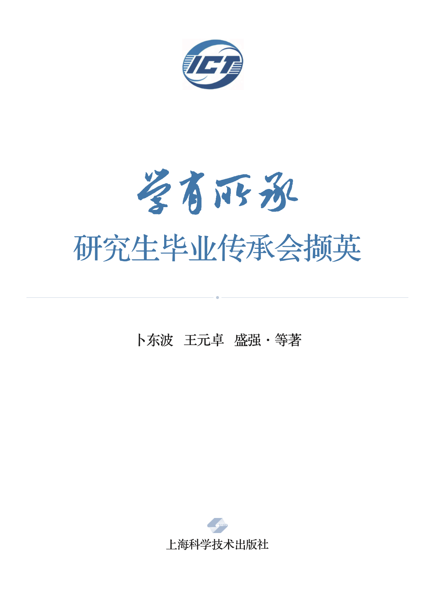
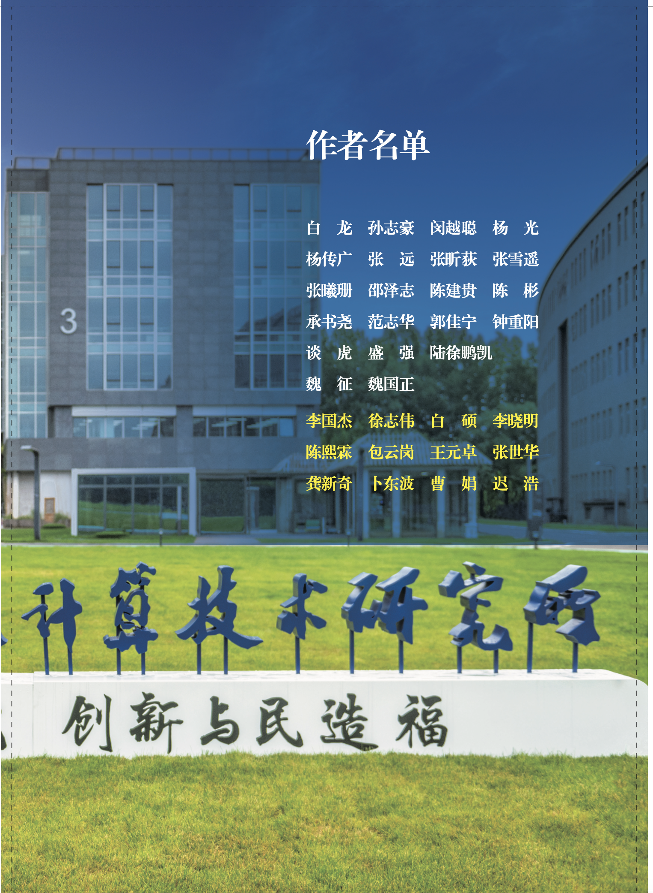

# 学有所承---研究生毕业传承会撷英

## 作者：

##内容提要

===============================

本书是“科研历史的忠实记录”---自 2017 年起， 中国科学院计算技术研究所前瞻研究实验室每年都举办一次“学有所承”毕业生经验传承会，由毕业生向在学同学分享经验、教训与感悟，共话学术与生活，多有真知灼见。毕业生和嘉宾老师们来自中国科学院计算所、软件所、数学院以及清华大学、北京大学、中国人民大学等院校，源多流深，异彩纷呈。本书汇编了传承会上同学们的精彩发言以及导师们的深思良盼。

所谓“薪火相传”，典出于《庄子·养生主》：“指穷于为薪，火传也，不知其尽也”。前瞻实验室举行“学有所承”传承会，毕业生们以己为“柴薪”，以多年的所得为“火种”，向百余名师弟师妹们传承，正是“薪火相传”之雅意。

全书共分四篇：第一篇“早已智珠在握”辑录毕业生在科研选题、 提出思路、读文献、建系统、做实验、组会交流、写论文等方面的具体建议，迹近于“术”；第二篇“更悟学术道通” 辑录毕业生们更深层次的思考，包括方法论、心理调适、如何激发“心流”，还有“什么是格局”这样的思考，迹近于“道”；第三篇“验谈说与后人听”辑录圆桌对话环节上，毕业生与在读同学们的对话，是答疑，是解惑；第四篇“雏凤清于老凤”辑录研究生导师们的所思所想，是欣慰，是期盼。

薪火相传---我们要深信：今日老生一言一行的传，犹如一粒一粒的种，他日新生当有满仓满屋的收！

久久为功---我们要深信：成功不必在我，功力必不唐捐！

## 第一篇·早已智珠在握
---
2 提升科研“变焦”能力——应用问题研究的三个视角
盛强 2023届

11 学术论文中不同层级创新的理解与反思
邵泽志 2024 届

15 在组会中提高收获的几个小方法
魏国正 2019 届

19 读研期间的一些经验教训
白龙 2024 届

27 类比与归纳:从生命语言到自然语言
魏征 2021 届 (清华大学) 

35 论文写作投稿经验总结
杨传广 2023 届
2
46 如何做“有新意”的研究 张雪遥 2022 届

56 开启心流的密码 张远 2018 届

62 关于“讲故事”的故事 杨光 2022 届

70 同时段多任务的处理策略 陈彬 2023 届

79 跨学科转型与科研方法论 谈虎 2024 届 (数学院)

## 第二篇·更悟学术道通
---
致广大而尽精微
承书尧 2024 届

89 心怀浪漫，保持热爱——致正经历科研逆境中的同学们
路徐鹏凯 2024 届

93 科研入门时期的选择与思考
孙志豪 2024 届

100 积跬步，至千里 范志华 2024 届

103 坐稳“冷”板凳，在不变中拥抱变化 张昕荻 2024 届(软件所)

113 学术前沿的探骊之道:从深耕文献到破题创新 钟重阳 2023 届

120 热爱一切 陈建贵 2024 届

123 拾级而上，共赴山海 闵越聪 2024 届

126 心怀热忱 奔赴万水千山 张曦珊 2017 届

130 沧海遗珠，鲜被提及的 UNIX 指北手册 郭佳宁 2020 届

## 第三篇·验谈说与后学听
---
134 意义 

138 明辨 

142 压力 

147 未来 

154 期望 

160 成长

## 第四篇·雏凤清于老凤
---
166 溯源我的学术谱系
李国杰

189 常记脚下的路，永葆年轻的心 ——毕业季徐志伟研究员专访 徐志伟

195 计算之雅——小议计算机领域研究成果的“优雅性” 白硕

199 毕业季，和大家聊聊“精神力量” 包云岗

203 计算所人的传承 王元卓

209 学有所承:在传承与碰撞中锤炼论文写作之道——参加“研究 生毕业传承会”的感悟与致谢
龚新奇

223 大师启示录 卜东波

229 关于伯乐——读《欧阳修传》 曹娟

234 在“学有所承”中触摸学术的温度 迟浩

## 致谢

本书得到[上海科技出版社等大力协助](Acknowledgement.md)。没有这些帮助，本书的问世是难以想象的

## 购买渠道

本书已在[京东](https://item.jd.com/13702980.html
)、[当当](http://product.dangdang.com/29386865.html
)上架。

